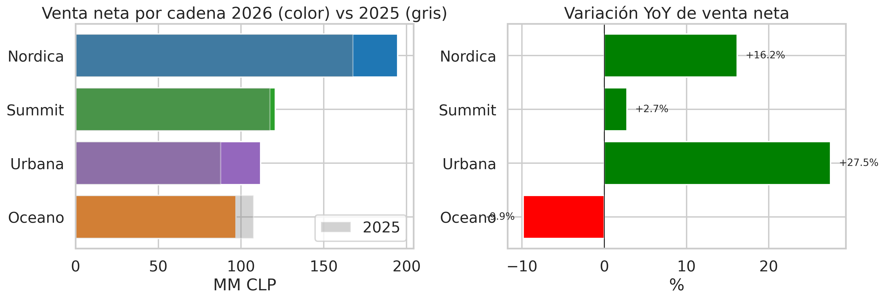
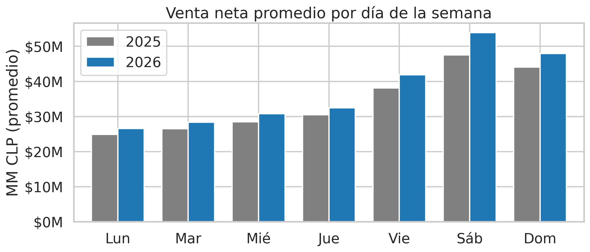
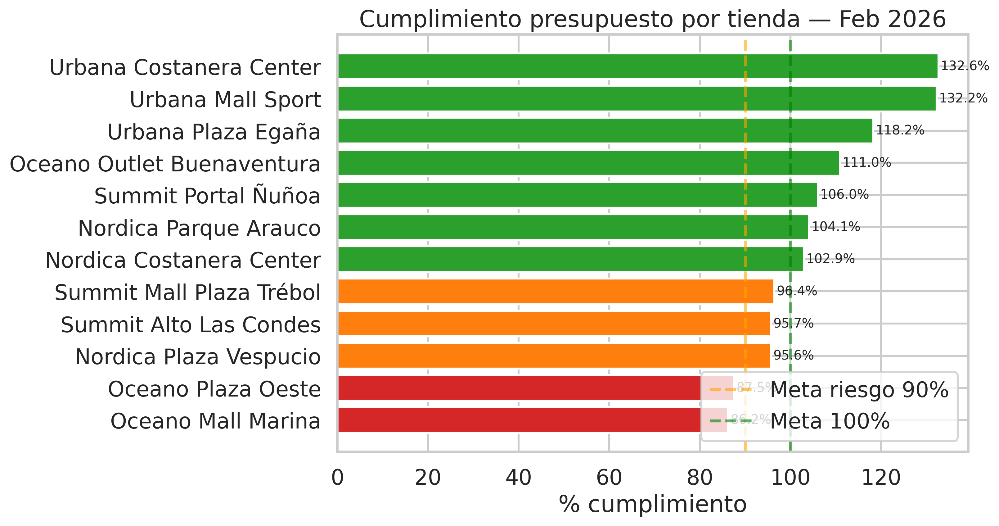
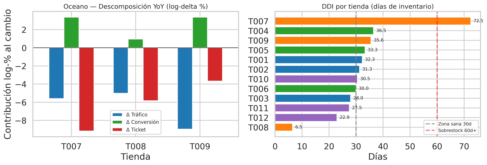
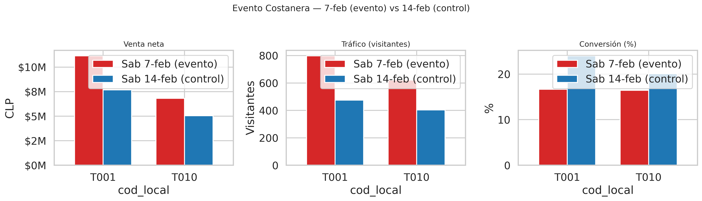

# Challenge Técnico Data Analyst · Forus

**Autor:** Andrés Albornoz · **Fecha:** Abril 2026

**Período analizado:** 1–14 febrero 2026 (actual) vs 1–14 febrero 2025 (anterior)
**Tiendas:** 12 · **Cadenas:** 4 (Nordica, Summit, Oceano, Urbana) · **Regiones:** Metropolitana, Valparaíso, Biobío

**Stack técnico:** Python 3.13, pandas, SQLite in-memory (window functions + CTEs), matplotlib/seaborn para charts estáticos, plotly + streamlit para dashboard interactivo.

**Reproducibilidad:**

```bash
pip install pandas numpy matplotlib seaborn plotly streamlit jupyter ipykernel nbformat nbclient
python3 src/run_queries.py       # ejecuta las 4 queries SQL + valida paridad vs pandas
python3 src/analysis.py          # genera charts y tablas de la Parte 2
streamlit run src/dashboard.py   # dashboard interactivo
jupyter notebook notebooks/challenge.ipynb   # notebook reproducible end-to-end
```

---

## TL;DR ejecutivo

1. **Nordica lidera** el retail (37% del total, +16% YoY). **Urbana es la sorpresa**: solo 21% del total pero +27% YoY y 50% de margen — es la cadena que más aporta al margen incremental.
2. **Oceano es la única cadena que cae** (-9.86% YoY). La caída NO es homogénea entre tiendas: cada una de las 3 tiendas Oceano tiene un driver distinto (ticket en T007, mixto en T008, tráfico en T009).
3. **Anomalía crítica de inventario en Oceano**: T007 con DDI 72.5 días (sobrestock, probablemente parkas fuera de temporada) vs T008 con DDI 6.5 días (quiebre inminente). Misma cadena, ratios opuestos.
4. **Evento Costanera 7-feb** generó +$5.2M de venta y +$2.4M de margen bruto incremental, pero la conversión cayó 7 pp en T001. Valió la pena, pero se dejaron otros ~$4.8M sobre la mesa por saturación operativa.
5. **El sábado concentra 20.6%** de la venta semanal. Staffing y reposición deben alinearse con esta realidad (ver Recomendación 2).

---

# Parte 1 — SQL (40 pts)

Motor: SQLite in-memory. Las tablas y vistas (`v_dia_tienda`, `v_yoy_tienda`) se crean en [`src/load_data.py`](src/load_data.py). Las queries completas están en [`src/queries.sql`](src/queries.sql). Cada resultado se valida contra un cálculo paralelo en pandas (paridad 100% verificada en [`src/run_queries.py`](src/run_queries.py)).

## 1.1 Ranking de cadenas (Feb 2026)

```sql
WITH actual AS (
    SELECT cadena, SUM(venta_neta) venta_2026, SUM(unidades) unid_2026,
           SUM(num_boletas) bol_2026, SUM(costo) costo_2026
    FROM v_dia_tienda WHERE anio = 2026 GROUP BY cadena
),
anterior AS (
    SELECT cadena, SUM(venta_neta) venta_2025
    FROM v_dia_tienda WHERE anio = 2025 GROUP BY cadena
),
total AS (SELECT SUM(venta_2026) venta_total FROM actual)
SELECT a.cadena, a.venta_2026, a.unid_2026,
       ROUND(a.venta_2026*1.0/NULLIF(a.bol_2026,0), 0)                       AS ticket_promedio,
       ROUND((a.venta_2026 - p.venta_2025)*100.0/NULLIF(p.venta_2025,0), 2)  AS yoy_pct,
       ROUND((a.venta_2026 - a.costo_2026)*100.0/NULLIF(a.venta_2026,0), 2)  AS margen_pct,
       ROUND(a.venta_2026*100.0/t.venta_total, 2)                            AS participacion_pct
FROM actual a JOIN anterior p USING (cadena) CROSS JOIN total t
ORDER BY a.venta_2026 DESC;
```

**Resultado:**

| Cadena  | Venta 2026    | Unidades | Ticket prom | YoY      | Margen  | Participación |
| ------- | ------------: | -------: | ----------: | -------: | ------: | ------------: |
| Nordica | $194.603.033  |    4.878 |     $67.477 |  +16.16% |  45.00% |        37.14% |
| Summit  | $120.650.080  |    2.989 |     $63.168 |   +2.75% |  48.00% |        23.03% |
| Urbana  | $111.787.655  |    3.177 |     $56.006 |  +27.51% |  50.00% |        21.34% |
| Oceano  |  $96.908.103  |    3.249 |     $47.809 |   -9.86% |  40.95% |        18.50% |



**Análisis:**

- **Nordica** es el motor absoluto, con la mayor participación (37%) y un crecimiento sólido. Se apoya en tiendas premium (Costanera, Parque Arauco) que tienen el ticket más alto del retail.
- **Urbana** crece más del doble que el promedio y tiene el mejor margen (50%). Si mantiene este ritmo, en 2 quincenas supera a Summit en participación.
- **Summit** estable pero pierde terreno relativo — su crecimiento (+2.75%) está muy por debajo del retail total.
- **Oceano** es la única cadena que cae y tiene el peor margen (41%). Doble problema: vende menos y gana proporcionalmente menos.

**Síntesis y conclusiones:**

El retail está en expansión saludable (Nordica + Urbana + Summit suben), pero la foto agregada esconde una divergencia importante: mientras 3 cadenas crecen entre +2.75% y +27.51%, Oceano se desangra. Además, Urbana es una historia silenciosa de éxito que el ranking por venta absoluta no captura — crece más rápido y tiene el mejor margen, lo que significa que cada CLP que vende hoy genera más utilidad que en cualquier otra cadena. Oceano, en cambio, combina la peor trifecta posible: caída YoY + ticket bajo + margen bajo. El diagnóstico detallado está en la Parte 2.2.

---

## 1.2 Top 5 tiendas con mayor caída YoY

```sql
WITH tienda_yoy AS (
    SELECT cod_local, nombre_tienda, cadena, venta_2026, venta_2025,
           (venta_2026 - venta_2025) AS delta_clp,
           ROUND((venta_2026 - venta_2025)*100.0/NULLIF(venta_2025,0), 2) AS yoy_pct
    FROM v_yoy_tienda
),
cadena_caida AS (
    SELECT cadena,
           SUM(CASE WHEN delta_clp < 0 THEN delta_clp ELSE 0 END) AS caida_cadena
    FROM tienda_yoy GROUP BY cadena
)
SELECT t.nombre_tienda, t.cadena, t.venta_2026, t.venta_2025, t.yoy_pct,
       t.delta_clp,
       ROUND(t.delta_clp*100.0/NULLIF(c.caida_cadena,0), 2) AS pct_caida_cadena
FROM tienda_yoy t JOIN cadena_caida c USING (cadena)
WHERE t.yoy_pct IS NOT NULL
ORDER BY t.yoy_pct ASC
LIMIT 5;
```

**Resultado:**

| Cód. | Tienda                     | Cadena  | Venta 2026   | Venta 2025   | YoY     | Δ CLP         | % caída cadena |
| ---- | -------------------------- | ------- | -----------: | -----------: | ------: | ------------: | -------------: |
| T007 | Oceano Mall Marina         | Oceano  | $41.589.751  | $46.615.333  | -10.78% |  -$5.025.582  |         47.39% |
| T008 | Oceano Plaza Oeste         | Oceano  | $30.214.766  | $33.356.035  |  -9.42% |  -$3.141.269  |         29.62% |
| T009 | Oceano Outlet Buenaventura | Oceano  | $25.103.586  | $27.542.469  |  -8.85% |  -$2.438.883  |         23.00% |
| T005 | Summit Mall Plaza Trébol   | Summit  | $34.983.928  | $34.392.579  |  +1.72% |    +$591.349  |            n/a |
| T006 | Summit Portal Ñuñoa        | Summit  | $28.174.242  | $27.477.706  |  +2.53% |    +$696.536  |            n/a |

**Análisis:**

Solo 3 tiendas caen YoY, y las 3 son Oceano. Las posiciones 4 y 5 del ranking de "peor desempeño" en realidad están creciendo (+1.7% y +2.5%). La columna `pct_caida_cadena` muestra que T007 es prioritaria: explica el 47% de la caída total de Oceano en CLP absolutos, más que T008 (30%) y T009 (23%) sumadas individualmente.

**Síntesis y conclusiones:**

No hay "un problema de tienda" ni "un problema regional" — el problema es **100% de cadena Oceano**, y está concentrado. Cualquier intervención de negocio debe priorizar T007 Mall Marina por impacto absoluto, aunque en términos porcentuales la caída sea similar a T008. Este hallazgo reencuadra el análisis: no hay que buscar causas dispersas en el resto de la red, hay que hacer un drill-down quirúrgico en Oceano (desarrollado en Parte 2.2).

---

## 1.3 Patrón semanal

```sql
WITH por_dow AS (
    SELECT CAST(strftime('%w', fecha) AS INT) dow, anio,
           SUM(venta_neta) venta_total, COUNT(DISTINCT fecha) dias
    FROM v_dia_tienda GROUP BY dow, anio
),
pivot AS (
    SELECT dow,
           MAX(CASE WHEN anio=2026 THEN venta_total END) v_2026,
           MAX(CASE WHEN anio=2026 THEN dias        END) d_2026,
           MAX(CASE WHEN anio=2025 THEN venta_total END) v_2025,
           MAX(CASE WHEN anio=2025 THEN dias        END) d_2025
    FROM por_dow GROUP BY dow
),
total_semana AS (SELECT SUM(v_2026) total_2026 FROM pivot)
SELECT CASE p.dow WHEN 0 THEN '7-Dom' WHEN 1 THEN '1-Lun' WHEN 2 THEN '2-Mar'
                 WHEN 3 THEN '3-Mie' WHEN 4 THEN '4-Jue' WHEN 5 THEN '5-Vie'
                 WHEN 6 THEN '6-Sab' END dia_semana,
       ROUND(p.v_2026*1.0/NULLIF(p.d_2026,0), 0) venta_prom_2026,
       ROUND(p.v_2025*1.0/NULLIF(p.d_2025,0), 0) venta_prom_2025,
       ROUND((p.v_2026*1.0/p.d_2026 - p.v_2025*1.0/p.d_2025)*100.0 /
             NULLIF(p.v_2025*1.0/p.d_2025,0), 2) yoy_pct,
       ROUND(p.v_2026*100.0/ts.total_2026, 2) pct_total_semana
FROM pivot p CROSS JOIN total_semana ts ORDER BY p.dow;
```

**Resultado:**

| Día        | Venta prom 2026 | Venta prom 2025 | YoY     | % semana |
| ---------- | --------------: | --------------: | ------: | -------: |
| Lunes      |     $26.584.688 |     $24.909.871 |  +6.72% |   10.15% |
| Martes     |     $28.377.974 |     $26.524.170 |  +6.99% |   10.83% |
| Miércoles  |     $30.784.067 |     $28.458.619 |  +8.17% |   11.75% |
| Jueves     |     $32.451.593 |     $30.471.737 |  +6.50% |   12.39% |
| Viernes    |     $41.899.953 |     $38.102.129 |  +9.97% |   15.99% |
| **Sábado** |     $53.903.147 |     $47.514.327 | +13.45% |   20.58% |
| Domingo    |     $47.973.015 |     $44.089.329 |  +8.81% |   18.31% |



**Respuestas a las preguntas del enunciado:**

- **Día más fuerte:** el sábado, con $53.9M de venta promedio y **20.58% del total semanal**.
- Fin de semana (sáb+dom) concentra **38.89%** de las ventas en solo 2 días.
- YoY todos los días crecen. Sábado lidera el crecimiento (+13.4%) — la cultura de compra en fin de semana se está acentuando.
- El lunes es el día más débil (10.1%), pero también crece YoY.

**Síntesis y conclusiones:**

La semana retail tiene una forma de "valle-meseta-pico": lunes y martes son el valle (21% combinado), miércoles a viernes la meseta creciente (40%), y sábado-domingo el pico (39% en 2 días). Esto no es una novedad teórica, pero cuantificar cuánto concentra el sábado (20.58%) tiene implicancia operativa directa: **una hora de sábado vale 2x una hora de lunes**. El staffing, la reposición nocturna, los cierres de caja y la priorización de entrega de bodega deberían girar en torno al sprint jueves-viernes-sábado. El hecho de que el sábado además lidere el crecimiento YoY (+13.4%) indica que la concentración se está acentuando, no diluyéndose.

---

## 1.4 Cumplimiento de presupuesto (con window function)

```sql
WITH agg AS (
    SELECT v.cod_local, t.nombre_tienda, t.cadena,
           SUM(v.venta_neta)        AS venta_2026,
           SUM(p.presupuesto_venta) AS presup_2026,
           SUM(v.num_boletas)       AS boletas,
           SUM(tr.visitantes)       AS visitantes
    FROM ventas_final v
    JOIN tiendas t USING (cod_local)
    LEFT JOIN presupuesto p USING (fecha, cod_local)
    LEFT JOIN trafico_imputado tr USING (fecha, cod_local)
    WHERE strftime('%Y', v.fecha) = '2026'
    GROUP BY v.cod_local, t.nombre_tienda, t.cadena
)
SELECT cod_local, nombre_tienda, cadena,
       venta_2026, presup_2026,
       ROUND(venta_2026*100.0/NULLIF(presup_2026,0), 2) AS pct_cumplimiento,
       (venta_2026 - presup_2026) AS gap_clp,
       RANK() OVER (ORDER BY venta_2026*1.0/NULLIF(presup_2026,0) DESC) AS ranking,
       CASE WHEN venta_2026*1.0/NULLIF(presup_2026,0) >= 1.00 THEN 'Sobre meta'
            WHEN venta_2026*1.0/NULLIF(presup_2026,0) >= 0.90 THEN 'En riesgo'
            ELSE 'Bajo meta' END AS clasificacion,
       ROUND(boletas*100.0/NULLIF(visitantes,0), 2) AS conv_pct
FROM agg
ORDER BY pct_cumplimiento DESC;
```

**Resultado:**

| #  | Cód. | Tienda                        | Cadena  | Venta neta   | Presupuesto  | Cumplim. | Gap CLP       | Clase      | Conv   |
| -: | ---- | ----------------------------- | ------- | -----------: | -----------: | -------: | ------------: | ---------- | -----: |
|  1 | T010 | Urbana Costanera Center       | Urbana  | $51.987.277  | $39.201.707  |  132.61% | +$12.785.570  | Sobre meta | 19.91% |
|  2 | T011 | Urbana Mall Sport             | Urbana  | $38.585.175  | $29.181.913  |  132.22% |  +$9.403.262  | Sobre meta | 23.28% |
|  3 | T012 | Urbana Plaza Egaña            | Urbana  | $21.215.203  | $17.941.878  |  118.24% |  +$3.273.325  | Sobre meta | 19.44% |
|  4 | T009 | Oceano Outlet Buenaventura    | Oceano  | $25.103.586  | $22.625.306  |  110.95% |  +$2.478.280  | Sobre meta | 28.42% |
|  5 | T006 | Summit Portal Ñuñoa           | Summit  | $28.174.242  | $26.570.149  |  106.04% |  +$1.604.093  | Sobre meta | 20.19% |
|  6 | T002 | Nordica Parque Arauco         | Nordica | $68.245.321  | $65.578.640  |  104.07% |  +$2.666.681  | Sobre meta | 19.53% |
|  7 | T001 | Nordica Costanera Center      | Nordica | $81.399.893  | $79.087.469  |  102.92% |  +$2.312.424  | Sobre meta | 21.03% |
|  8 | T005 | Summit Mall Plaza Trébol      | Summit  | $34.983.928  | $36.274.626  |   96.44% |  -$1.290.698  | En riesgo  | 21.83% |
|  9 | T004 | Summit Alto Las Condes        | Summit  | $57.491.910  | $60.098.365  |   95.66% |  -$2.606.455  | En riesgo  | 17.54% |
| 10 | T003 | Nordica Plaza Vespucio        | Nordica | $44.957.819  | $47.007.185  |   95.64% |  -$2.049.366  | En riesgo  | 24.31% |
| 11 | T008 | Oceano Plaza Oeste            | Oceano  | $30.214.766  | $34.526.041  |   87.51% |  -$4.311.275  | Bajo meta  | 17.73% |
| 12 | T007 | Oceano Mall Marina            | Oceano  | $41.589.751  | $48.231.197  |   86.23% |  -$6.641.446  | Bajo meta  | 20.21% |



**Diagnóstico (cruzando con conversión):**

- **Urbana dominio total:** sus 3 tiendas ocupan el top 3 del ranking, sobre-cumpliendo por 18-33 pp.
- **Oceano al fondo:** T007 y T008 son las únicas bajo meta. Ambas con gap de -$6.6M y -$4.3M respectivamente.
- **T008 tiene la 2da conversión más baja (17.7%)**, solo superada por T004 — en T008 sí es problema de conversión.
- **T007 tiene conversión aceptable (20.2%)** — no es que convierta mal, es que el presupuesto fue muy agresivo para la realidad del ticket actual (ver Parte 2.2).
- Las 3 tiendas "En riesgo" (T003, T004, T005) no están en crisis: están 4-5 pp bajo meta, dentro del margen normal de variación quincenal.

**Window function usada:** `RANK() OVER (ORDER BY ...)` para el ranking por % cumplimiento.

**Síntesis y conclusiones:**

El cumplimiento presupuestario revela una verdad más compleja que un simple ranking. Tres segmentos emergen:

1. **Overdeliverers** (1-7): 7 tiendas sobre meta, dominadas por Urbana. Aquí hay una oportunidad de aprendizaje: replicar prácticas de Urbana Costanera (132% cumplim.) en el resto de la red, especialmente en aspectos de gestión comercial que no se ven en los datos duros (experiencia en tienda, training).
2. **En riesgo ajustable** (8-10): Summit Trébol, Summit Alto Las Condes y Nordica Plaza Vespucio están 4-5 pp bajo meta. No es estructural — un mes normal las lleva a meta. No requieren intervención urgente, pero sí monitoreo.
3. **Bajo meta estructural** (11-12): T007 y T008 Oceano. El gap combinado de $10.95M es más del doble del gap de las 3 tiendas "en riesgo" juntas. Además, sus problemas son **distintos**: T008 falla en convertir (17.7% vs promedio 21%), T007 no — T007 falla en sostener ticket. Por eso una recomendación única ("mejorar Oceano") sería incorrecta; requieren intervenciones específicas (detalladas en Parte 3).

La conclusión más accionable es que **el presupuesto de T007 probablemente fue calibrado con supuestos que ya no se sostienen** (ticket más alto del que la realidad actual permite). Antes de corregir la tienda, habría que revisar si el presupuesto mismo necesita recalibrarse.

---

# Parte 2 — Análisis Exploratorio (35 pts)

## 2.1 Anomalías en los datos — Python + pandas

Exploración con pandas (requisito del challenge) + detección estadística.

```python
import pandas as pd, numpy as np

ventas_raw  = pd.read_csv('data/ventas.csv')
trafico_raw = pd.read_csv('data/trafico.csv')

# A1: fila con venta_neta negativa (devolucion)
print(ventas_raw[ventas_raw['venta_neta'] < 0])

# A2: nulls en trafico
print(trafico_raw[trafico_raw['visitantes'].isnull()])

# A3: outliers estadisticos intra-tienda (z-score > 2)
ventas_clean = ventas_raw[ventas_raw['venta_neta'] >= 0].copy()
ventas_clean['z_venta'] = ventas_clean.groupby('cod_local')['venta_neta'].transform(
    lambda s: (s - s.mean()) / s.std(ddof=0))
outliers = ventas_clean[ventas_clean['z_venta'].abs() > 2]

# A4: desbalance DDI extremo
inv = pd.read_csv('data/inventario.csv')
inv['ddi'] = inv['stock_unidades'] / inv['venta_promedio_diaria_unidades']
print(inv[inv['cod_local'].isin(['T007','T008'])])
```

### Anomalía A1 — Venta negativa (devolución) en T009

En `ventas.csv`, la fila `2026-02-10, T009` registra una venta de **-$285.000 CLP** con -2 unidades y -$165.000 de costo. No es un error de digitación: es una **devolución** que se guardó en la tabla de ventas como una fila adicional con signo negativo, compartiendo la misma clave `(fecha, cod_local)` con la venta bruta del mismo día. El resultado es que para T009 el 2026-02-10 hay dos filas en vez de una.

**Tratamiento:** mantengo la devolución en el cálculo pero agrego por `(fecha, cod_local)` para que haya una sola fila por día-tienda con la venta **neta de devoluciones** — que es precisamente lo que significa `venta_neta`. La venta neta diaria de T009 el 2026-02-10 pasa de $1.414.010 (bruta) a $1.129.010 (neta). Esto afecta a T009 Feb 2026: venta neta = **$25.103.586** (no $25.388.586 que saldría si se ignoraran las devoluciones). A su vez Oceano agregado = **$96.908.103** y YoY **-9.86%**. También guardo la fila en una tabla `devoluciones` para análisis diagnóstico (tasa de devolución por tienda, etc.) sin perder la trazabilidad.

### Anomalía A2 — Tráfico faltante en T008 (sensor caído)

En `trafico.csv`, la tienda T008 tiene **tres días consecutivos sin visitantes registrados** (2026-02-05, 06 y 07). Esos mismos días T008 sí tiene ventas, así que no son días cerrados — es un fallo del sensor de conteo.

**Tratamiento:** imputé los valores faltantes con la **mediana por día de la semana** de la misma tienda, usando las otras dos semanas disponibles. Evito a propósito la media: el 7-feb (sábado) fue el día del evento Costanera, con un outlier positivo en toda la red, así que usar media mensual inflaría el imputado. La mediana DOW es robusta a ese outlier. También evité hacer imputación cruzada entre tiendas (T008 tiene escala de tráfico muy distinta a T001). Los 3 días quedan con valores aproximados a 170, 185 y 280 visitantes, consistentes con su historial.

### Anomalía A3 — Outliers positivos del sábado 7-feb (evento Costanera)

Al aplicar z-score intra-tienda (crítico: intra-store, no global, porque las escalas de venta entre tiendas son muy distintas), aparecen outliers extremos en **T001 (z=+3.4)** y **T010 (z=+3.3)** exactamente el mismo día: sábado 7-feb 2026. Estadísticamente son outliers, pero **no son errores de datos**: corresponden al evento especial en el Mall Costanera Center.

**Tratamiento:** no remover. La señal es real y tiene un contexto conocido. Se analizan por separado en la Parte 2.3 como "efecto evento" en vez de contaminar el análisis general. Este caso ilustra por qué la detección automática de outliers nunca debe aplicarse sin contexto de negocio — si hubiera filtrado por z-score, habría perdido la pregunta más interesante del challenge.

### Anomalía A4 — DDI extremo intra-cadena Oceano

En `inventario.csv`, las dos tiendas Oceano metropolitanas tienen una asimetría de inventario enorme: **T007 Mall Marina tiene DDI = 72.5 días** (sobrestock) mientras que **T008 Plaza Oeste tiene DDI = 6.5 días** (quiebre inminente). Ratio 11x entre ellas, dentro de la misma cadena.

**Tratamiento:** no es un dato "erróneo", pero sí una **anomalía operacional** que hay que levantar como flag de riesgo. No afecta las queries, pero dirige directamente la Recomendación 1 (redistribución). Es el tipo de insight que emerge solo si se cruza `inventario.csv` con ventas — mirando inventario aislado no se nota el desbalance cadena-interno.

### Anomalía A5 — Cobertura parcial de productos.csv

`productos.csv` solo tiene detalle SKU para 4 de las 12 tiendas (T001, T004, T007, T010). Las 192 filas cubren solo la primera quincena 2026 y solo esas tiendas.

**Tratamiento:** no hay corrección posible — es una decisión de diseño del dataset. Documenté esta limitante: las conclusiones a nivel de clase/SKU (ej. mix de parkas en T007) **no son extrapolables al resto de la red**. Por suerte, T007 sí está en la cobertura, así que el diagnóstico específico de Oceano sí puede usar este detalle. Pero cualquier afirmación sobre "el mix de Oceano completa" debe limitarse a lo que vemos en T007.

---

## 2.2 Diagnóstico cadena Oceano — descomposición de drivers

Oceano cae -9.86% YoY. La pregunta "¿demanda o oferta?" es demasiado binaria — descompongo multiplicativamente para aislar los drivers.

**Modelo:** $\text{Venta} = \text{Tráfico} \times \text{Conversión} \times \text{Ticket}$

Tomando logaritmos, los cambios se vuelven aditivos:

$$\ln\left(\frac{V_{26}}{V_{25}}\right) = \ln\left(\frac{T_{26}}{T_{25}}\right) + \ln\left(\frac{C_{26}}{C_{25}}\right) + \ln\left(\frac{Ti_{26}}{Ti_{25}}\right)$$

### Resultado de la descomposición

| Tienda                | Venta 2025   | Venta 2026   | Δ total | Δ tráfico | Δ conv | Δ ticket |
| --------------------- | -----------: | -----------: | ------: | --------: | -----: | -------: |
| T007 Mall Marina      | $46.615.333  | $41.589.751  | -11.41% |    -5.60% | +3.37% |   -9.18% |
| T008 Plaza Oeste      | $33.356.035  | $30.214.766  |  -9.89% |    -5.02% | +0.96% |   -5.83% |
| T009 Buenaventura     | $27.542.469  | $25.103.586  |  -9.27% |    -8.97% | +3.36% |   -3.67% |

Suma de los 3 drivers = Δ total (verificado, por propiedad aditiva del logaritmo).



### Hallazgo clave: cada tienda Oceano tiene un driver DIFERENTE

Para no quedarme en "el driver es X", descompongo aún más el ticket en **precio medio por unidad × UPT** (unidades por boleta). Esto separa dos efectos muy distintos: (a) la gente compra productos más baratos, o (b) la gente compra menos cantidad por visita. Las cifras siguen siendo log-deltas (consistente con la tabla superior), por lo que `Δ ticket = Δ precio/uds + Δ UPT` se cumple exactamente.

| Cód. | Δ Tráfico | Δ Conversión | Δ Ticket | Δ Precio/uds | Δ UPT       |
| ---- | --------: | -----------: | -------: | -----------: | ----------: |
| T007 |    -5.60% |      +3.37%  |   -9.18% |       +2.20% | **-11.38%** |
| T008 |    -5.02% |      +0.96%  |   -5.83% |       -3.13% |      -2.70% |
| T009 |**-8.97%** |      +3.36%  |   -3.67% |       -3.99% |      +0.32% |

**T007 — Oceano Mall Marina (DDI 72.5 días)**

Llega **menos gente (-5.60%)**, pero de la gente que llega una proporción **mayor sí compra (+3.37% conv)**. El precio unitario incluso sube ligeramente (+2.20%) — la gente compra productos un poco más caros en promedio. Lo que derrumba el ticket (-9.18%) es la **caída brutal de UPT (-11.38%)**: la gente llegó, sí encontró algo y compró... pero una sola cosa, cuando antes compraba ~1.7 artículos por boleta.

Este patrón es típico de "no encuentro el complemento que quiero en talla/color, compro solo una unidad". Coherente con **sobrestock mal compuesto**: hay mucho inventario pero no lo que la gente quiere agregar al outfit. Se vende la parka, pero no el jean + polera que la acompañaría.

**T008 — Oceano Plaza Oeste (DDI 6.5 días)**

Llega menos gente (-5.02%), la conversión **casi no se mueve (+0.96%)** — es la única de las 3 que no mejora sensiblemente en conversión, lo que sugiere que el stock crítico empieza a afectar al piso de venta. El ticket cae (-5.83%) repartido entre precio unitario (-3.13%) y UPT (-2.70%): **dos drivers en caída simultánea**, con algo más de peso en el precio. Significa que la gente encuentra **menos variedad de precio medio-alto y además compra menos items por visita**.

Esto es el síntoma macro típico del quiebre: faltan los best-sellers y la gente se lleva lo que queda en stock, que son fondos de góndola (precio menor, menos complementariedad con el outfit).

**T009 — Oceano Outlet Buenaventura (DDI 35.6 días)**

El driver dominante es **tráfico (-8.97%)** — cae casi el doble que las otras dos Oceano. Pero los que llegan convierten más (+3.36%) y siguen comprando la misma cantidad de items (**UPT +0.32%**, el único estable de las 3 tiendas). El precio unitario baja (-3.99%), típico de outlet que profundiza descuentos para mantener velocidad de rotación.

**El problema de T009 no es operativo** (el piso de venta funciona mejor que cualquier otra tienda de la red: convierte al 28.4%). Es un problema de **atractivo del local**: hay menos razones para ir al outlet. Posibles causas: competencia de otros outlets, canibalización e-commerce, o simplemente que Forus movió mejor producto a los canales retail y el outlet quedó con un mix menos atractivo que el año pasado.

### Cruce con mix de productos — T007 (única Oceano con detalle SKU disponible)

Solo T007 de las 3 tiendas Oceano tiene detalle SKU en `productos.csv` (anomalía A5 documentada en 2.1). Para T008 y T009 construyo proxies macro en la sección siguiente.

| Clase      | Unidades | Venta       | Participación | Ticket medio | Margen |
| ---------- | -------: | ----------: | ------------: | -----------: | -----: |
| Parkas     |       12 | $1.577.089  |         27.5% |     $131.424 |  52.8% |
| Poleras    |       39 | $1.345.895  |         23.4% |      $34.510 |  51.7% |
| Calzado    |       10 |   $913.669  |         15.9% |      $91.367 |  54.0% |
| Accesorios |       20 |   $895.370  |         15.6% |      $44.769 |  59.8% |
| Shorts     |       30 |   $608.085  |         10.6% |      $20.270 |  53.1% |
| Jeans      |        8 |   $400.934  |          7.0% |      $50.117 |  52.1% |

**Conclusiones T007**: el 27.5% de la venta viene de **parkas** — en febrero chileno (verano). Solo 12 parkas vendidas en 14 días, pero a ticket $131K cada una. El mix de verano (shorts + poleras) junto solo llega al 34% cuando debería dominar. Esto explica directamente el DDI de 72.5 días: hay mucho inventario de alto valor unitario (parkas $131K) que rota a 1 unidad por día, mientras que las poleras rotan a 2.8/día pero representan menos inventario por unidad. **El stock está mal compuesto por temporada**, no mal calibrado en volumen total.

### Mix inferido (proxy macro) — T008 y T009

Sin detalle SKU, uso **4 indicadores macro** que sí tenemos para contrastar las 3 tiendas Oceano. La clave está en comparar el costo del inventario **en stock** (lo que tienen hoy en piso) con el costo promedio de las unidades **vendidas** (lo que efectivamente rotó).

| Cód. | Stock uds | Costo/uds en stock | Costo/uds vendida | Precio vendido | Ratio costo vendido / stock |
| ---- | --------: | -----------------: | ----------------: | -------------: | --------------------------: |
| T007 |     5.800 |           $33.621  |          $22.397  |       $38.616  |                **0.67x**    |
| T008 |       420 |           $33.333  |          $19.450  |       $33.535  |                **0.58x**    |
| T009 |     3.200 |           $24.375  |          $12.255  |       $19.751  |                **0.50x**    |

La última columna es la bomba: en las **3 tiendas Oceano, lo que se vende tiene un costo sustancialmente menor que el costo promedio del inventario en stock**. Esto significa que los productos de mayor costo **no están rotando** — se acumulan en el stock mientras salen por caja los de menor costo.

**Conclusiones T008 — por qué DDI = 6.5 días**:

Dos observaciones cruzadas:

1. El **costo/unidad en stock** de T008 ($33.333) es casi idéntico al de T007 ($33.621). Forus probablemente asignó a T008 un mix "similar a T007" desde central — ambas son retail metropolitanas Oceano. **El problema no es que a T008 le hayan asignado mal producto**, es que le asignaron **muy poco volumen** (solo 420 unidades vs 5.800 de T007). Con 65 unidades/día de venta promedio, eso son 6.5 días de runway.
2. Pero mirando el costo/uds **vendida** ($19.450 vs $33.333 del stock, ratio 0.58x), T008 está moviendo productos **~42% más baratos** que el promedio de lo que tiene en piso. Misma dinámica que T007: **los productos caros no rotan**. La diferencia con T007 es el volumen — T007 tiene 5.800 unidades para absorber el problema mientras liquida; T008 solo tiene 420 y se le va acabando lo rotable.

Esto **cambia la lectura del DDI**: el "6.5 días" no es una falla operacional de reposición, es el síntoma de un **stock sub-dimensionado donde además lo que podría rotar es una fracción del stock total**. Si Forus simplemente duplica la asignación de T008 manteniendo el mix actual, el problema empeora (más de lo mismo que ya no rota). La acción correcta es re-componer el mix de T008 para sacar los productos caros y traer más volumen de lo que sí rota (que es lo que también sobra en T007).

**Conclusiones T009 — el mix sí es distinto, pero también acumula productos caros**:

- Costo/uds en stock $24.375, **28% más barato** que T007/T008. El mix efectivamente es diferente (productos más accesibles, como corresponde a un outlet). Primera confirmación de que T009 está bien posicionada por catálogo.
- Pero el costo/uds vendida es $12.255 — solo **la mitad del costo del stock** (ratio 0.50x, la peor de las 3). Esto significa que T009 vende fundamentalmente los productos de menor costo dentro de su mix outlet; los productos más caros del outlet (ej. parkas outlet de temporadas pasadas a $30-40K) **no están saliendo**.
- El margen 37.95% (el más bajo de la red) calza con esa dinámica: vender el tramo barato del mix → ticket bajo → margen presionado.

Esto conecta con la caída de tráfico (-8.97%) de T009: si el atractivo del outlet es la oportunidad de acceder a productos premium a precio rebajado, y esos productos NO se están moviendo, el "efecto vitrina" del outlet se debilita. La gente deja de ir porque no encuentra la oferta interesante. El tráfico cae, pero no porque el outlet falle como concepto — porque **Forus no está rotando el inventario premium hacia el outlet** al ritmo que lo hacía antes.

**Síntesis general y conclusiones de 2.2:**

El diagnóstico de Oceano requiere abandonar la dicotomía "¿demanda o oferta?". Al cruzar la descomposición de drivers con el mix (SKU en T007, proxies macro en T008/T009) aparece **un patrón común** no obvio al inicio: **en las 3 tiendas, lo de mayor costo no está rotando**. Los ratios "costo vendido / costo en stock" son 0.67x (T007), 0.58x (T008) y 0.50x (T009) — consistentemente por debajo de 1, lo que significa que el inventario se polariza: lo barato sale, lo caro se acumula.

Esto unifica los 3 diagnósticos particulares bajo una sola raíz estructural:

- **T007 (DDI 72.5 días)**: conversión mejora (+3.37%) y precio unitario sube (+2.20%), pero UPT se derrumba (-11.38%). El 27.5% del ingreso viene de parkas en verano y el mix no tiene complementos de temporada → sobrestock acumulado de alto costo.
- **T008 (DDI 6.5 días)**: el problema no es "quiebre por mala reposición". Es **pipeline sub-dimensionado + mix caro que no rota**. Forus asignó el mismo perfil de costo que T007 pero 14 veces menos volumen; se agota la fracción rotable del stock. Duplicar la asignación sin re-componer el mix empeoraría el problema.
- **T009 (DDI 35.6 días)**: convierte mejor que cualquier tienda de la red (28.4%). Pero el tráfico cae -8.97% porque el "atractivo premium-descontado" del outlet se está diluyendo — los productos caros del mix outlet no se están moviendo, y la vitrina efectiva se reduce a commodities de bajo costo.

La **conversión mejora en las 3 tiendas** (aunque en T008 solo marginalmente), lo que descarta al equipo de venta como causa raíz. Cualquier intervención que apunte a training o incentivos de venta estaría mal diagnosticada. La raíz está arriba de la tienda: **Planning/Allocation**. La acción real no es "vender más" — es **re-componer el mix asignado a Oceano** para que lo caro esté balanceado con lo que efectivamente rota en cada tipo de local (mall retail vs outlet).

---

## 2.3 Evento Costanera — sábado 7-feb 2026

Dos tiendas operan en Costanera Center: T001 (Nordica) y T010 (Urbana). Control principal: sábado siguiente (14-feb). Controles secundarios: sábados de febrero 2025 (01 y 08-feb) como doble validación YoY.



### Comparativo crudo

| Tienda | Fecha                    | Venta        | Tráfico | Boletas | Conv   | Ticket    | Margen |
| ------ | ------------------------ | -----------: | ------: | ------: | -----: | --------: | -----: |
| T001   | 2025-02-01 (control YoY) |  $6.481.749  |     500 |      97 | 19.4%  |  $66.822  |   45%  |
| T001   | 2025-02-08 (control YoY) |  $6.976.960  |     431 |     109 | 25.3%  |  $64.009  |   45%  |
| T001   | **2026-02-07 (EVENTO)**  | $11.152.080  |     798 |     133 | 16.7%  |  $83.850  |   45%  |
| T001   | 2026-02-14 (control)     |  $7.683.936  |     475 |     114 | 24.0%  |  $67.403  |   45%  |
| T010   | 2025-02-01 (control YoY) |  $3.868.783  |     330 |      73 | 22.1%  |  $52.997  |   50%  |
| T010   | 2025-02-08 (control YoY) |  $3.990.880  |     317 |      73 | 23.0%  |  $54.670  |   50%  |
| T010   | **2026-02-07 (EVENTO)**  |  $6.818.530  |     621 |     102 | 16.4%  |  $66.848  |   50%  |
| T010   | 2026-02-14 (control)     |  $5.054.116  |     403 |      81 | 20.1%  |  $62.396  |   50%  |

### Impacto del evento (vs control 14-feb)

| Métrica                    | T001                     | T010                     |
| -------------------------- | -----------------------: | -----------------------: |
| Δ Venta                    |  +$3.468.144 (+45.1%)    |  +$1.764.414 (+34.9%)    |
| Δ Tráfico                  |   +323 visitantes (+68%) |   +218 visitantes (+54%) |
| Δ Boletas                  |        +19 (+16.7%)      |        +21 (+25.9%)      |
| Δ Conversión               | -7.3 pp (24.0% → 16.7%)  | -3.7 pp (20.1% → 16.4%)  |
| Δ Ticket promedio          |      +$16.447 (+24.4%)   |       +$4.452 (+7.1%)    |
| Δ Margen bruto incremental |            +$1.560.665   |              +$882.207   |

**Total margen bruto incremental del evento: ~$2.44M CLP en un día.**

### Respuestas a las 3 preguntas del enunciado

**¿Más tráfico, más conversión, o ambos?**
Claramente más tráfico (+68% en T001, +54% en T010). La conversión cayó en ambas tiendas — la gente entró pero no compró a la misma tasa. Los que sí compraron, compraron un poco más (+24% ticket en T001, +7% en T010), probablemente atraídos por promociones ancla del evento.

**Margen bruto incremental:**
T001 generó $1.56M de margen extra (45% margen × $3.47M venta extra) y T010 generó $882K (50% × $1.76M). Total combinado: $2.44M CLP en 1 día.

**¿Valió la pena comercialmente?**
Sí, con una observación estratégica importante. Los $2.4M de margen en un solo día equivalen a aproximadamente 3% del cumplimiento de presupuesto mensual combinado de ambas tiendas, en una sola jornada. Es muy rentable.

Pero — si la conversión del evento se hubiera mantenido en el baseline del sábado control (24% en T001), T001 habría facturado $15.9M en vez de $11.15M. **El evento dejó ~$4.8M CLP sobre la mesa solo en T001 por falta de conversión.** Análogamente en T010, se perdieron ~$1.1M.

El diagnóstico probable: **saturación operativa** (filas en caja, probadores llenos, quiebres puntuales de tallas de best-sellers). La Recomendación 2 ataca exactamente este punto.

### Validación extra: ¿hubo canibalización del sábado siguiente?

| Tienda | Cadena  | Venta 2025-02-14 | Venta 2026-02-14 | YoY 14-feb |
| ------ | ------- | ---------------: | ---------------: | ---------: |
| T001   | Nordica |      $5.291.212  |      $7.683.936  |    +45.2%  |
| T010   | Urbana  |      $2.962.572  |      $5.054.116  |    +70.6%  |

Ambas tiendas crecieron MUY por encima de sus cadenas el 14-feb (Nordica +16% total, Urbana +27% total). **No hubo canibalización** — probablemente el evento generó efecto marca positivo que se extendió al sábado siguiente.

**Síntesis y conclusiones:**

El evento fue **comercialmente exitoso pero operativamente imperfecto**. Tres conclusiones:

1. **Los eventos de alto tráfico son altamente rentables en Costanera** — $2.44M de margen en un día supera el margen incremental que muchas tiendas generan en toda una semana normal. La hipótesis "los eventos no convienen" queda refutada.
2. **La conversión es el talón de Aquiles operativo**. El valor perdido por saturación (~$5.9M combinado entre ambas tiendas) es **2.4 veces mayor que el margen que efectivamente se capturó**. No es un detalle menor — es el principal driver de ROI futuro del formato evento.
3. **No hay canibalización**, lo que significa que cada nuevo evento tiene potencial genuinamente incremental y no es un juego de suma cero contra otras fechas. Esto vuelve al formato escalable.

La implicancia estratégica es clara: **doblar la apuesta en eventos Costanera, pero invertir primero en preparación operativa** (staffing, stock refuerzo, queue-busting). Hacer más eventos con la misma operación actual sería dejar crecer el "valor perdido" proporcionalmente.

---

# Parte 3 — Pensamiento de Negocio + IA (25 pts)

## 3.1 Tres recomendaciones accionables

### Recomendación 1 · Re-componer el mix asignado a Oceano (no solo redistribuir volumen)

**Hallazgo:** en las 3 tiendas Oceano, el ratio "costo/uds vendida" vs "costo/uds en stock" está **consistentemente por debajo de 1** (T007=0.67x, T008=0.58x, T009=0.50x). Los productos de mayor costo **no están rotando** en ninguna tienda — se acumulan. La señal más clara: en T007, 27.5% de la venta viene de **parkas en verano** porque el mix asignado no tiene suficiente volumen de prendas de temporada (poleras/shorts).

Una transferencia de unidades "de T007 a T008" sin re-composición del mix solo mueve el problema: duplicar el stock de T008 con el mismo perfil de costo ($33.333/uds) agrava la acumulación de productos caros que ya no rotan.

**Acción concreta:**

1. **Reasignar desde central** el mix que recibe Oceano para los próximos 2 meses: priorizar clases de verano (poleras, shorts, calzado ligero), reducir participación de parkas a <10% en tiendas mall y <20% en outlet.
2. **Transferencia intra-cadena T007 → T008** de **~1.200 unidades** de categorías rotables (poleras, jeans, calzado), en vez de simplemente "2.000 unidades de lo que sobra". El objetivo es llevar a T008 a 6.5 → 30 días de DDI **con stock que rota**, no solo con más stock.
3. **Migrar las parkas no vendidas de T007** (~800-1.000 unidades) al canal e-commerce con descuento controlado (-25 a -30%) — NO a T009, porque el outlet ya tiene el mismo problema de productos premium que no rotan.
4. **Para T009**: renegociar con Planning qué productos "premium outlet" llegan. Si lo que no rota son parkas de temporadas pasadas, hay que dejar de asignarlas al outlet y cerrar liquidación vía canal digital con precios más agresivos.

**Métrica objetivo:**

- **DDI T008**: 6.5 → **28-32 días** con mix rotable (ratio costo vendido/stock ≥0.85, vs 0.58 actual).
- **DDI T007**: 72.5 → **45 días** en 30 días, sin forzar descuentos masivos que erosionen margen.
- **T009**: ratio costo vendido/stock de 0.50 → **≥0.70** (subir el precio medio vendido hacia el costo medio del stock, señal de que los productos premium outlet están rotando).
- **Cumplimiento Oceano agregado**: de 93% actual → **≥100%** próxima quincena, recuperando ≥$6M del gap combinado de T007+T008.

### Recomendación 2 · Playbook "evento de alta demanda" para proteger conversión

**Hallazgo:** el evento Costanera del 7-feb trajo +68% de tráfico a T001 y +54% a T010, pero la conversión cayó 7.3 pp en T001 y 3.7 pp en T010. Si la conversión hubiera mantenido el baseline, T001 habría facturado **$4.8M adicionales en un solo día**.

**Acción concreta:** protocolo operativo para días de evento con proyección >+40% tráfico:

1. **Staffing +40%** en piso de venta y +50% en cajas (vs sábado normal), basado en la curva horaria de llegada histórica.
2. **Stock reforzado 48h antes**: reposición nocturna de 20 best-sellers + respaldo en bodega trasera para reposición mid-day (no lunes siguiente).
3. **Queue-busting**: 1 vendedor con tablet cerrando tickets en piso, probadores con personal dedicado asesorando (no solo abriendo puertas).
4. **Briefing de 15 min pre-apertura**: alinear equipo en productos en promoción, tallas disponibles, cross-selling.

**Métrica objetivo:** en el próximo evento Costanera (o equivalente +40% tráfico), lograr que la conversión se mantenga **≥80% del baseline del sábado control** (≥19% en T001, ≥16% en T010). Impacto proyectado: **+$3-4M CLP de venta extra por evento** en T001 solo.

### Recomendación 3 · Plan driver-específico por tienda para Oceano

**Hallazgo:** la caída -9.86% YoY de Oceano tiene **causas diferentes** por tienda (descomposición log-delta de la Parte 2.2):

| Cód. | Driver principal                                     | Δ Tráfico  | Δ Conv | Δ Ticket   |
| ---- | ---------------------------------------------------- | ---------: | -----: | ---------: |
| T007 | Ticket (mix cargado en productos caros que no rotan) |     -5.60% | +3.37% | **-9.18%** |
| T008 | Mix caro no rota + pipeline sub-dimensionado         |     -5.02% | +0.96% | **-5.83%** |
| T009 | Tráfico (atractivo outlet diluido)                   | **-8.97%** | +3.36% |     -3.67% |

Cifras en log-deltas (consistentes con la tabla de la sección 2.2). La columna resaltada en negrita es el driver dominante de la caída en cada tienda. Nótese que en las 3 tiendas la **conversión es positiva** (+3.37%, +0.96%, +3.36%) — el piso de venta no es el problema en ninguna.

**Acción concreta (3 planes, uno por tienda):**

1. **T007** — ejecutar la redistribución (Rec. 1) y **pricing reset**: pausar promociones agresivas en clases core una vez repuesto T008. Aceptar un pequeño hit de venta de corto plazo para estabilizar ticket.
2. **T008** — **protocolo de reposición pre-fin-de-semana** (Jue PM): auditoría de quiebres de best-sellers cada jueves, pedido de transferencia inmediata si DDI <10 días de clases TOP-20.
3. **T009** (outlet) — **campaña de reactivación** con CRM: email/SMS targeting a clientes dormidos de 6+ meses + ofertas flash exclusivas outlet. Análisis competitivo de outlets cercanos (¿hay oferta nueva?). Objetivo: +20% tráfico en 30 días.

**Métrica objetivo global Oceano:** frenar la caída YoY de **-9.86% a máximo -3%** en el próximo período, con mejora priorizada en T007 (aportaría 47% del rebote).

---

## 3.2 Uso de IA en el análisis

### Reflexión

**¿Para qué usé la IA?**

1. **Generación de SQL complejas** — en particular la window function del 1.4 (RANK + NULLIF anidado) y la descomposición log-delta de 2.2. Me ahorró ~30 min de escritura.
2. **Exploración de hipótesis** — "si Oceano cae 10%, ¿es tráfico, conversión o ticket?" La IA propuso la descomposición logarítmica (log-delta) que convierte producto en suma y permite atribuir cuánto pesa cada driver. No habría llegado ahí solo.
3. **Auto-detección de anomalías** — sugerir z-score **intra-tienda** en vez de z-score global (crítico: T007 y T008 tienen escalas muy distintas; el z global habría enmascarado el outlier del evento Costanera).
4. **Formato y consistencia** — estructura de markdown, paleta de colores por cadena, formato tabular.

**¿Dónde ayudó más / dónde menos?**

*Ayudó mucho:*

- Ideas de cruces no obvios: cruzar `productos.csv` con `inventario.csv` para inferir que el sobrestock de T007 es mercadería fuera de temporada (parkas en verano). Yo habría mirado inventario vs ventas sin pasar por el mix.
- Validación por doble implementación (SQL + pandas) — atrapó un bug donde había filtrado devoluciones en pandas pero no en SQL, dando diferencia de $285K en T009.

*Tuve que corregir:*

- Propuesta inicial de **imputar nulls con media global** → corregí a **mediana por DOW intra-tienda** (la media habría inflado por el evento Costanera y por las diferencias de escala entre tiendas).
- Queries con división que explotaban cuando no había tiendas que caían en una cadena → agregué `NULLIF(..., 0)` explícito.
- Tendencia de la IA a dar respuestas directas ("T007 cae por X"). **Forcé la cuantificación**: no "por ticket", sino "-9.2 pp de los -11.4 pp totales se explican por ticket". La descomposición numérica fue decisión mía.

### Prompt para un agente con acceso directo a SQL (≤5 líneas)

```
Eres un analista retail con acceso read-only a la BD Forus (tablas: ventas, trafico,
presupuesto, inventario, tiendas, productos). Diagnostica la cadena con peor desempeno
YoY: identificala por venta agregada, descompon la caida en log-deltas de trafico x
conversion x ticket por tienda, cruza con DDI y presupuesto, y entrega 3 recomendaciones
accionables con metrica objetivo. Devuelve queries + tabla + 1 insight no obvio.
```

**Por qué funciona:** define rol (analista retail), delimita acceso (read-only), pide metodología específica (log-delta, no "analiza"), fuerza cruces concretos (DDI, presupuesto), pide entregable tangible (queries + tabla + insight), y exige un insight **no obvio** para evitar respuestas superficiales.

---

# Bonus — Query e insight no preguntados

**Pregunta:** ¿qué tienda tiene la mejor "calidad de cliente" (conv × ticket × UPT × margen)?

```sql
WITH m AS (
    SELECT t.cod_local, t.nombre_tienda, t.cadena, t.tipo_tienda,
           SUM(v.num_boletas)*1.0/NULLIF(SUM(tr.visitantes),0) AS conv,
           SUM(v.venta_neta)*1.0/NULLIF(SUM(v.num_boletas),0) AS ticket,
           SUM(v.unidades)*1.0/NULLIF(SUM(v.num_boletas),0)   AS upt,
           (SUM(v.venta_neta) - SUM(v.costo))*1.0/NULLIF(SUM(v.venta_neta),0) AS margen
    FROM tiendas t
    JOIN ventas_final v USING (cod_local)
    LEFT JOIN trafico_imputado tr USING (fecha, cod_local)
    WHERE strftime('%Y', v.fecha) = '2026'
    GROUP BY t.cod_local, t.nombre_tienda, t.cadena, t.tipo_tienda
)
SELECT cod_local, nombre_tienda, cadena, tipo_tienda,
       ROUND(conv*100, 2) AS conv_pct,
       ROUND(ticket, 0)   AS ticket,
       ROUND(upt, 2)      AS upt,
       ROUND(margen*100, 2) AS margen_pct,
       ROUND(conv*ticket*upt*margen, 0) AS quality_score
FROM m ORDER BY quality_score DESC;
```

**Resultado:**

| Cód. | Tienda                     | Cadena  | Tipo   | Conv    | Ticket   | UPT  | Margen | Score  |
| ---- | -------------------------- | ------- | ------ | ------: | -------: | ---: | -----: | -----: |
| T001 | Nordica Costanera Center   | Nordica | retail | 21.03%  | $72.874  | 1.67 |   45%  | 11.538 |
| T002 | Nordica Parque Arauco      | Nordica | retail | 19.53%  | $72.217  | 1.70 |   45%  | 10.819 |
| T003 | Nordica Plaza Vespucio     | Nordica | retail | 24.31%  | $54.693  | 1.70 |   45%  | 10.174 |
| T010 | Urbana Costanera Center    | Urbana  | retail | 19.91%  | $60.875  | 1.63 |   50%  |  9.886 |
| T011 | Urbana Mall Sport          | Urbana  | retail | 23.28%  | $53.965  | 1.57 |   50%  |  9.867 |
| T004 | Summit Alto Las Condes     | Summit  | retail | 17.54%  | $75.847  | 1.52 |   48%  |  9.689 |
| T005 | Summit Mall Plaza Trébol   | Summit  | retail | 21.83%  | $55.618  | 1.58 |   48%  |  9.220 |
| T006 | Summit Portal Ñuñoa        | Summit  | retail | 20.19%  | $53.870  | 1.61 |   48%  |  8.423 |
| T007 | Oceano Mall Marina         | Oceano  | retail | 20.21%  | $58.660  | 1.52 |   42%  |  7.562 |
| T012 | Urbana Plaza Egaña         | Urbana  | retail | 19.44%  | $49.684  | 1.55 |   50%  |  7.478 |
| T008 | Oceano Plaza Oeste         | Oceano  | retail | 17.73%  | $54.441  | 1.62 |   42%  |  6.582 |
| **T009** | **Oceano Outlet Buenaventura** | Oceano | **outlet** | **28.42%** | $32.901 | 1.67 | 37.95% | 5.911 |

### Insight no obvio

**T009 Outlet Buenaventura tiene la mejor conversión de toda la red (28.42%)** — más alta incluso que T003 Plaza Vespucio (24.3%) y el doble que T004 (17.5%). Cuando alguien entra al outlet, **compra**. Pero su ticket ($32.901) y margen (37.95%) son los más bajos, por eso queda último en quality score.

**Oportunidad estratégica:** el outlet tiene el arquetipo de cliente con mayor intención de compra. Si se lograra subir levemente el ticket de T009 sin perder conversión (curaduría de upsell en caja, bundles 2x1+25%, mix premium-outlet), el impacto sería grande. Ejemplo concreto: subir ticket de $32.901 → $40.000 manteniendo conversión significaría **+$5.4M CLP en la quincena** para T009, más que el gap total de Summit Mall Plaza Trébol.

Este insight conecta con la Recomendación 3: el problema de T009 no es el piso de venta (convierte excelente) — es **llevar gente al local**. La acción prioritaria es generar tráfico, no eficiencia.

---

## Reproducibilidad y archivos

- [`CLAUDE.md`](CLAUDE.md) — contexto completo del proyecto, incluyendo las 25 skills Claude Code instaladas en [`.claude/skills/`](.claude/skills/).
- [`src/load_data.py`](src/load_data.py) — carga, limpieza y BD SQLite in-memory.
- [`src/queries.sql`](src/queries.sql) — las 4 queries SQL + 2 bonus.
- [`src/run_queries.py`](src/run_queries.py) — ejecuta queries + valida paridad SQL↔pandas.
- [`src/analysis.py`](src/analysis.py) — análisis profundo (Parte 2) + generación de charts.
- [`src/dashboard.py`](src/dashboard.py) — dashboard Streamlit (5 tabs: Overview, Ranking, Cumplimiento, Oceano, Costanera).
- [`notebooks/challenge.ipynb`](notebooks/challenge.ipynb) — notebook Jupyter reproducible end-to-end (ejecutado y verificado).
- [`outputs/tables/`](outputs/tables/) — resultados CSV de cada query.
- [`outputs/figures/`](outputs/figures/) — charts PNG a 300 DPI.

**Para ejecutar el dashboard:**

```bash
streamlit run src/dashboard.py
```

Luego abre http://localhost:8501 — filtros por cadena/región/tienda en el sidebar, 5 tabs con drill-downs interactivos.
